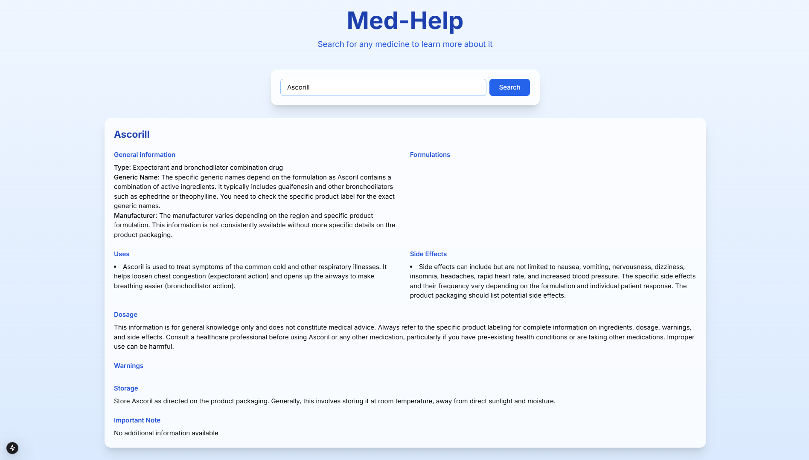
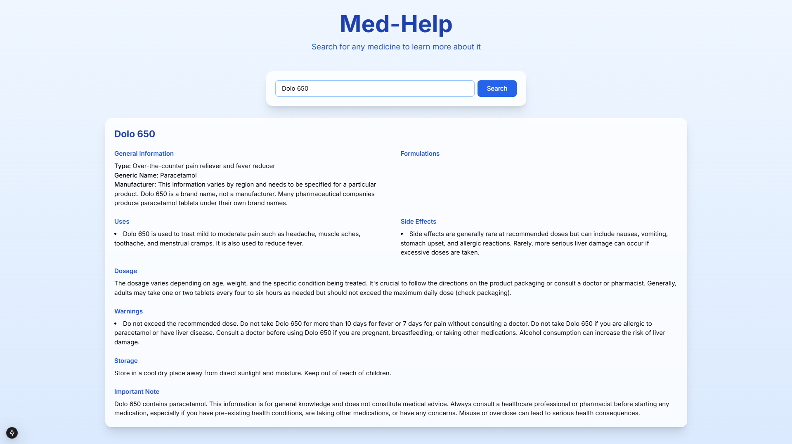
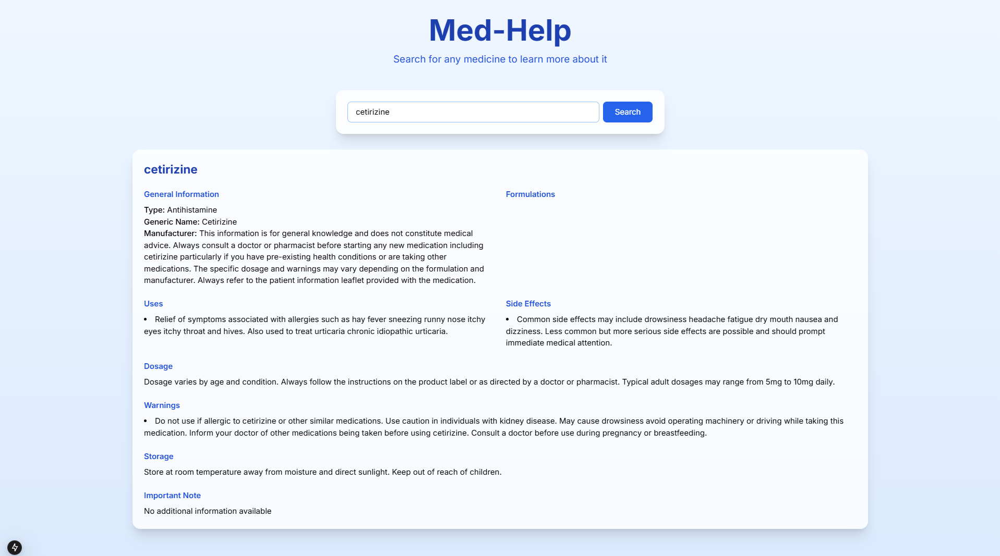
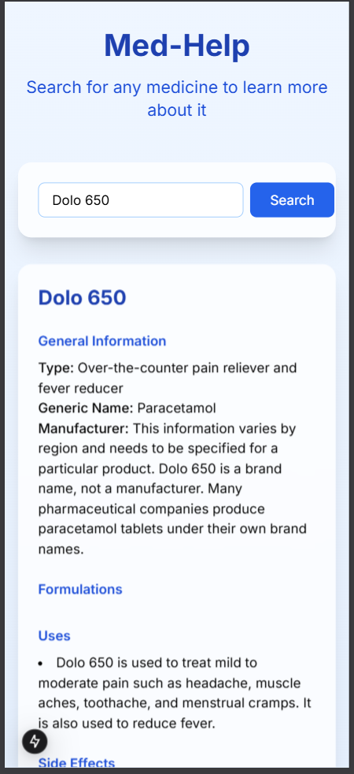

# Med-Help

Med-Help is a Next.js project designed to analyze medical information and provide detailed information about various medications. This project aims to offer comprehensive details of the medicine. It uses Gemini and Tailwind CSS for styling and layout.

## Features

- Analyze medical information
- Provide detailed information about medications
- User-friendly interface
- Used Gemini-Api for searching Information
- Styled with Tailwind CSS

## Installation

To get started with Med-Help, follow these steps:

1. Clone the repository:
   ```bash
   git clone https://github.com/bPavan16/med-help.git
   ```
2. Navigate to the project directory:
   ```bash
   cd med-help
   ```
3. Install the dependencies:
   ```bash
   npm install
   ```
4. Run the development server:
   ```bash
   npm run dev
   ```

## Usage

To use Med-Help, simply enter the medication information in the provided format and the application will analyze and display the details.

### Input Format

- **Name**: The name of the medication.
- **Type**: The type of medication.
- **Generic Name**: The generic name of the medication.
- **Manufacturer**: The manufacturer of the medication.
- **Formulations**: List the forms and strengths of the medication.
- **Uses**: The uses of the medication.
- **Dosage**: The recommended dosage of the medication.
- **Warnings**: Any warnings associated with the medication.
- **Side Effects**: Possible side effects of the medication.
- **Storage**: Storage instructions for the medication.
- **Important Note**: Any important notes about the medication.

## Contributing

We welcome contributions to improve Med-Help. Please fork the repository and submit a pull request.

## License

This project is licensed under the MIT License.

## Sample Images

Here are some sample images showing the web and phone views of the Med-Help application:

### Web View





### Phone Display
<div align="center"> 
   

   
</div>
